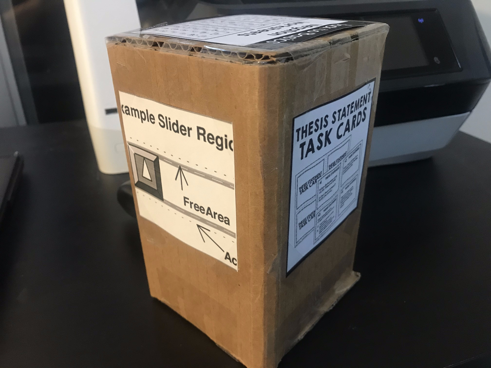
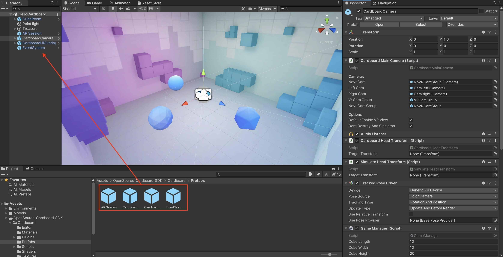

# Opensource Cardboard VR system for iPhone devices

Copyright 2020 "VR substitutor" Team (Kailun Wan, Yanda Li, Yizhou Wang).

This is an opensource cardboard VR system project in Unity, implemented from [mobfish Cardboard Unity SDK](https://github.com/mobfishgmbh/Cardboard-VR-Unity-SDK). It is built on Unity 2019.4.9f1, with the ARFoudnation 2.1.10, AR Subsystems 2.1.3, ARCore XR Plugin 2.1.12 and ARKit XR Plugin 2.1.10. This project works on iPhone devices which support of AR technology only.

# Preparation

In order to use our system, you need to have a compatible iPhone device (iPhone 6s or later), a development platform (MacBook with XCode), two Universal Wireless VR Remote & Gamepad (like [Fortune Tech](https://www.amazon.com/gp/product/B06XKPTMWZ/ref=ppx_yo_dt_b_asin_title_o01_s01?ie=UTF8&psc=1) or [Alupper](https://www.amazon.com/gp/product/B08FSRRNF9/ref=ppx_yo_dt_b_asin_title_o01_s00?ie=UTF8&psc=1)), and a Cardboard Viewer(like [Google Cardboard Viewer](https://www.amazon.com/Google-87002823-01-Official-Cardboard-Brown/dp/B01MQ5J5J4/ref=sxts_sxwds-bia-wc-nc-drs1_0?cv_ct_cx=google+cardboard&dchild=1&keywords=google+cardboard&pd_rd_i=B01MQ5J5J4&pd_rd_r=3c496796-07bc-4407-8ccd-48c62b42f4a9&pd_rd_w=3InPs&pd_rd_wg=nwW5X&pf_rd_p=84ce0865-d9ca-42e3-87ed-168be8f93162&pf_rd_r=NVXC8GF2PH89CGWZQVCE&psc=1&qid=1607305552&sr=1-1-88388c6d-14b8-4f70-90f6-05ac39e80cc0)). 

The Cardboard Viewer can be any brand, but it should at least work with your iPhone's screen size and contain a QR code viewer profile at the bottom.

Moreover, you need to make sure to cut a small hole on the front of your viewer to avoid occulding the camera at the back of our iPhone.

The VR controller, however, can be any brand but need to have the **exact same type** (shape and buttons) like this.

Since different type of controller has different button mapping to the mobile devices, our system need this exact type to work without changing the button mapping in our source codes.

In addition, you need to make two hand made cubes and attach the bluetooth controllers perpendicular to one face near the bottom.

The recommend dimensions of such cube is 10cm/10cm/20cm for length/width/height. The controller is attached to one of the face has length and height.

Next, you need to download our images under **Assets/OpenSource_Cardboard_SDK/HandController/Tracked Images**. Please print those 12 images with the dimension of 10cm x 10cm, and attach them to the faces of both cubes at the same height. 

**The order of the images are important.** Image 0 should be attached to the face with the left controller, and then follow the **clockwise order** to attach Image 1, 2, 3 on the other 3 faces. Image 4 should be attached to the top face, while image 5 to the bottom face. Similarly, you need to attach image 6-11 on the corresponding faces of the right cube. **The rotation of those images are also essential.** For example, please make sure that you don't attach the images upside down.

Here is what your left cube supposed to be:

Here is what your right cube supposed to be:

Please make sure that both of your hand controllers are connected to your device successfully and the controllers are power on. You can put the switch on the side of the controllers to "KEY", and press any buttons such as A and B to see if the controllers can control your devices (increasing or reducing the volumn, for example). If success, please switch the side button to "GAME".

After you have make those preparations mentioned above, you can begin to try our system! In this repo, we provide all of our files under several folders such as Assets and Packages. You can download and copy all folders into your own Unity project. For convenience, we also provide two .unitypackage to import the necessary files into the project without copying the folders. 

**Demo.unitypackage** is for users who want to [try our painting demo in a cubes room](https://youtu.be/2WLhy9QTawE). 

**SDK.unitypackage**, however, is for other developers who want to design their own projects and deploy them onto the iPhone devices with VR effects and 6 DoF using our system. We provide multiple APIs for others design their own functionalities, instead of our paiting app, to control the app with two hand cube-attached controllers. 

We will provide the instructions on how to setup the project for both user groups below.

# Instructions

1. Download and Install Unity Hub. Install Unity 2019.4.9f1. 
 
2. Under "Installs" tab, click the three dots of this version, and open "Add Modules". Please make sure if you have at least installed the "iOS Build Support".
 

 
3. For users, press the "NEW" button under projects table, and create a new **3D** project with any name you like. For developers, open the project you want to use our system with this Unity version. Please make sure that your existing project can work successfully in this version before adopting our system.
 

 
4. Navigate to **Window > Package Manager**, find and install ARFoundation (version 2.1.10), AR Subsystems (version 2.1.3, installed automatically with ARFoundation), ARCore XR Plugin (version 2.1.12, not necessary on iPhone devices, but useful to expand our system to Android devices in the future) and ARKit XR Plugin (version 2.1.10).
 

 
## Configuring iOS project settings

Navigate to **File > Build Settings**, select **iOS** and choose **Switch Platform**.
  
### Player Settings

1. change company name under "player" tab to some unique name you want.
   

   
2. Navigate to **Project Settings > Player > Resolution and Presentation**. Set the **Default Orientation** to **Landscape Left**.
   

 
3. Navigate to **Project Settings > Player > Other Settings**. In **Camera Usage Description**, write "Cardboard SDK requires camera permission to read the QR code (required to get the encoded device parameters).". In **Target minimum iOS Version**, write 12.0. Check **Requires ARKit Support**. In **Architecture**, choose ARM64.
   

   
4. Navigate to **Project Settings > Player > XR Settings**. Make sure **Virtual Reality Supported"** is **not** checked.
   

Next, import the unitypackage into the Unity project. The **following section** is for regular users **who wants to use our painting app**. For **developers who wants to use our system in their own projects**, please **skip the next section**. However, if you are **not familar with iOS building with XCode** in Unity, please **consult the following demo section** for more info.

# Instructions to install painting demo (regular users, not for developers)

1. Delete **Scene** folder under **Assets**.

2. Navigate to **Assets > Import Package > Custom Package..."**, and then choose the downloaded **Demo.unitypackage**.

3. Import all files into the project.

4. Double click **HelloCardboard** under **Assets/demo/Scenes** to open the demo scene.

5. Navigate to **File > Build Settings > Add Open Scenes**.

6. Navigate to **File > Build and Run**, provide a location to save the compiled files. The XCode should open automatically after Unity finishing compiling.

7. If you are new to Xcode and iOS build on iPhone devices, you need to setup your own Apple ID in order to install the app on your mobile device. Navigate to **Xcode > Preferences...**, then in **Accounts** tab, click **+** to add your Apple ID into Xcode. After you successfully setup your account, you should see your Apple ID info under **Accounts** tab (Personal Team).

8. Then, in Xcode project, navigate to **Unity-iPhone > Signing & Capabilities**, check **Automatically manage signing** and choose the Team of your own personal team. Also make sure you choose **your iOS Device** instead of Any iOS Device (arm64) at the top of the Xcode application. Then, press the Play button to install the app on your iPhone (Please make sure your phone screen is not locked).

9. You may encounter the **Could Not Launch** error during installation. If occurs, navigate to **Settings > General > Device Management > Apple Development: ... on your iPhone**, and **Trust** the developer account. Then, you can click the **Play** button in Xcode to rerun the app.

10. If the app is working properly, you can press the **Stop** button in Xcode, unconnect your iPhone from MacBook, and use it on iPhone as a normal app.

To begin playing the app in a specific Cardboard viewer, press the QR button first after the app is open. It then need to detect the viewer profile of your cardboard viewer. Then, the stereo VR effects will automatically adjust to the size for this viewer. If you change the viewer, repeat this process to readjust the VR screen effects.

For our painting app, when a hand controller is seen by the camera (camera sees any image on the cube):
- press and hold button A on the left controller, or button X on the right controller to draw a line with the movement of your hand;
- press button B on left or button Y on right to undo previous drawings until all drawings are removed;
- press button UP on left or button LEFT on right to change pen size;
- press button DOWN on left or button RIGHT on right to change pen color;

That is all for how to run our painting demo based on our OpenSource Cardboard VR system. If you are an ordinary user and just want to try our painting app, you can stop here. Otherwise, if you are a App developer, and want to develop your own app using our system, please continue reading as we give instructions on how to import our SDK into your existing project. We will also provide some APIs to get the button information and the hand controller positions for you to design your own functionalities and scripts.

# Instructions to use SDK in existing projects (for developers)

1. Navigate to **Assets > Import Package > Custom Package..."**, and then choose the downloaded **SDK.unitypackage**.

2. Import all files into the project.

3. Navigate to **Assets/OpenSource_Cardboard_SDK/Cardboard/Prefabs/**, drag all four prefabs into **Hierarchy**. Place these prefabs at the same location of your original camera, If you ever modified your own camera before from the default **Main Camera** from the new empty Unity project (such as adding extra components or scripts), please also them on to **CardboardCamera** gameobject you dragged into the Hierarchy. In short, replace your own camera with **CardboardCamera** without affecting the camera's functionality.

4. In the **Inspector** of the **CardboardCamera**, there is a script component called **Game Manager**. This is the major script we provide in our system to achieve 6 DoF of hand controllers movements and buttons signal detection. There are four parameters you can provide to **Game Manager**: Cube Length, Cube Width, Cube Height and Continue Frames. The first three parameters are the dimensions of the handmade cube in cm. We recommend to make 10cm/10cm/20cm for length/width/height, but you can make your own dimensions for cubes. The dimensions for both cubes should be the same, and then you can change those values in the parameters to reflect your cube sizes.

   The fourth paramenter, **Continue Frames**, is to represent how many frames to render the hand controller gameobject if the image disappears from the camera's FoV. The hand object will continue rotate at a constant speed for "**Continue Frames**" frames then disappear. If you want to make the hand object disappear quickly when the camera fails to see the cube images, reduce this number; otherwise, you can increase this number. The recommend value is 60 or 120, meaning rendering 60/120 more frames when the cube images become out of the field of view of the iPhone camera.

5. It is even possible to choose your own 12 cube images for image tracking. The 12 images we used in our system is located under **Assets/OpenSource_Cardboard_SDK/HandController/Tracked Images**. You can replace them with your own images, but please make sure your images are named from 0.jpg to 11.jpg. The format for images must be .jpg, and the name of the files must be "0" to "11" (0.jpg to 11.jpg). Then, please check **Assets/OpenSource_Cardboard_SDK/HandController/ReferenceImageLibrary** has the correct 12 images you provided, with the correct number names and other settings (check marks and 0.1 (Physical Size (Meters)). Then, you need to follow the order mentioned above to attach your images to cubes' faces.

6. Then, you can write your own scripts to achieve some functionalites of your app. Please make sure to add **GameManager** variables in your script in order to call our APIs in **Game Manager**. The calling method varies due to which gameobject you attach your own scripts to. For example, if you attach your own script onto **CardboardCamera**, which has the **Game Manager** script component, you can get set the variable in the image below, and call any APIs you want for controller button and position information. The details returned from our APIs are placed at the end of this instruction. You can then develop your own app using our OpenSource Cardboard VR system!

# API methods:
- **public string GetButtonStatesLeft()**: 

  return button status (A,B,UP,DOWN) from the left controller as a string of four characters. Each character has the value of 'T' (press the button), 'H' (holding the button), and 'F' (release the button). For example, "HFFF" means the button A is holding, and "FTFT" means the button B and DOWN button are pressed.
    
- **public string GetButtonStatesRight()**: 

  return button status (X,Y,LEFT,RIGHT) from the right controller as a string of four characters. Each character has the value of 'T' (press the button), 'H' (holding the button), and 'F' (release the button). For example, "HFFF" means the button X is holding, and "FTFT" means the button Y and RIGHT button are pressed.
    
- **public bool IsLeftActive()**: 

  return true if left hand is visible (image on the left cube is visible to iPhone camera). Otherwise return false.

- **public bool IsRightActive()**: 

  return true if right hand is visible (image on the right cube is visible to iPhone camera). Otherwise return false.
   
- **public Vector3 GetPositionLeft()**: 

  return the position (Vector3) of the left arm (left parent gameobject - cylinder).
    
- **public Vector3 GetPositionRight()**: 

  return the position (Vector3) of the right arm (right parent gameobject - cylinder).

- **public Vector3 GetRotationLeft()**: 

  return the Angle (Vector3, Quaterion.rotation.eulerAngles) of the left arm (left parent gameobject - cylinder).

- **public Vector3 GetRotationRight()**: 

  return the Angle (Vector3, Quaterion.rotation.eulerAngles) of the right arm (right parent gameobject - cylinder).

- **public Vector3 GetPositionLeftHand()**: 

  return the position (Vector3) of the left hand (left child gameobject - sphere).
    
- **public Vector3 GetPositionRightHand()**: 

  return the position (Vector3) of the right hand (right child gameobject - sphere).

- **public Vector3 GetRotationLeftHand()**: 

  return the Angle (Vector3, Quaterion.rotation.eulerAngles) of the left hand (left child gameobject - sphere).

- **public Vector3 GetRotationRightHand()**: 

  return the Angle (Vector3, Quaterion.rotation.eulerAngles) of the right hand (right child gameobject - sphere).   
    
- **public Vector3 GetScaleLeftHand()**: 

  return the scale (Vector3, localScale) of the left hand (left child gameobject - sphere).
    
- **public Vector3 GetScaleRightHand()**: 

  return the scale (Vector3, localScale) of the right hand (right child gameobject - sphere).

- **public Color GetColorLeftHand()**: 

  return the color of the material on the left hand (left child gameobject - sphere).

- **public Color GetColorRightHand()**: 

  return the color of the material on the right hand (right child gameobject - sphere).

- **public void SetScaleLeftHand(Vector3 scale)**: 
  
  set the scale (Vector3, localScale) of the left hand (left child gameobject - sphere) to change the hand size.
    
- **public void SetScaleRightHand(Vector3 scale)**: 

  set the scale (Vector3, localScale) of the right hand (right child gameobject - sphere) to change the hand size.

- **public void SetColorLeftHand(Color color)**: 

  set the color of the material on the left hand (left child gameobject - sphere) to change the hand color.

- **public void SetColorRightHand(Color color)**: 

  set the color of the material on the right hand (right child gameobject - sphere) to change the hand color.
    
These are all APIs we provide for our system in current version. If you need more information, feel free to modify our core script, **Game Manager** under **Assets/OpenSource_Cardboard_SDK/HandController/Scripts/** to change and expand the APIs. If you want to use other type of wireless controllers, you should also need to change the **SetInputButtons()** to map your controller's signals onto the devices. Other variables may also need to change as well.

# Remarks
Thank you for using our OpenSource Cardboard VR system. We hope you have an enjoyable time while using it. Welcome anyone's contribution to make it more robust and broad of use. Feel free to make tickets if there is any bugs, and do Pull Requests if you have some suggestions for feature or bug fix.

# License
mobfish Unity Cardboard SDK License:

https://github.com/mobfishgmbh/Cardboard-VR-Unity-SDK/blob/master/LICENSE.md

Official Google Cardboard SDK License:

https://github.com/googlevr/cardboard/blob/master/LICENSE

Protocol Buffer License:

https://github.com/protocolbuffers/protobuf/blob/master/LICENSE

The "Google Cardboard" name is a trademark owned by Google and is not included within the assets licensed under the Apache License 2.0.

# Special Thanks

Kailun Wan

Yanda Li

Yizhou Wang

[Bala Kumaravel](https://www.tkbala.com/)

[Bjoern Hartmann](http://people.eecs.berkeley.edu/~bjoern/)

We thank you for your contributions and ideas to this project.
